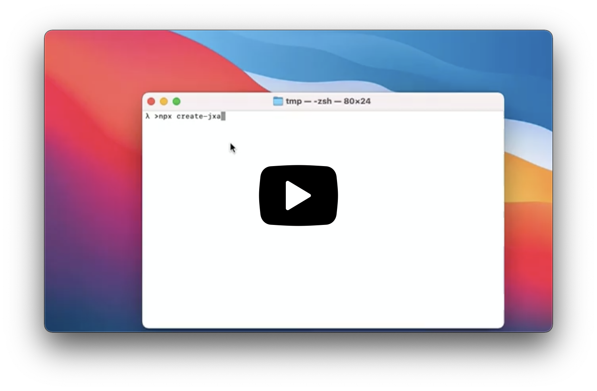

# Create JXA App

Create JXA Apps and Command Line Scripts with no build configuration.

This Setup is only supported on MacOS > 10.11.

If something doesn’t work, please file an [issue](https://github.com/aheissenberger/macos-jxa-bundler/issues).
If you have questions or need help, please ask in [GitHub Discussions](https://github.com/aheissenberger/macos-jxa-bundler/discussions).

## Quick Overview

```sh
npx creat-jxa-app my-app
cd my-app
npm start
```

The compiled MacOs App is created in the `build` folder and can be started.

<a href="https://github.com/aheissenberger/macos-jxa-bundler/blob/main/docs/resources/create-jxa-app.mp4?raw=true" target="video">
    
  </a>


## Creating an App

You’ll need to have Node 10.16.0 or later version on your local development machine (but it’s not required on the server). We recommend using the latest LTS version. Only MacOS is supported.

To create a new app, you may choose one of the following methods:

### npx

```sh
npx creat-jxa-app my-app
```

_([npx](https://medium.com/@maybekatz/introducing-npx-an-npm-package-runner-55f7d4bd282b) is a package runner tool that comes with npm 5.2+ and higher, see [instructions for older npm versions](https://gist.github.com/gaearon/4064d3c23a77c74a3614c498a8bb1c5f))_

### npm

```sh
npm init jxa-app my-app
```
_`npm init <initializer>` is available in npm 6+_

### Yarn

```sh
yarn create jxa-app my-app
```
_[`yarn create <starter-kit-package>`](https://yarnpkg.com/lang/en/docs/cli/create/) is available in Yarn 0.25+_

It will create a directory called `my-app` inside the current folder.<br>
Inside that directory, it will generate the initial project structure and install the transitive dependencies:

```
my-app
├── README.md
├── node_modules
├── package.json
├── .gitignore
├── build
└── src
    ├── index.js

```

No configuration or complicated folder structures, only the files you need to build your app.<br>
Once the installation is done, you can open your project folder:

```sh
cd my-app
```

Inside the newly created project, you can run some built-in commands:

### `npm start` or `yarn start`

Runs the compiler in watch mode. Finale application is in `build` folder.
All libaries are bundled.
There is a sourcemap inlined for debugging and the sourcecode is not mangled or compressed.

### `npm test` or `yarn test`

Runs `jest` with your tests.
### `npm run build` or `yarn build`

Builds the app for production to the `build` folder.<br>
It correctly bundles all external libaries in production mode and optimizes the build for the best performance. No sourcemap files and code is mangled and compressed.

Your app is ready to be deployed.

## All CLI options

```
Description
    Create a JXA App project setup

  Usage
    $ create-jxa-app [project_directory] [options]

  Options
    -template, --<path-to-template>    specify a template for the created project
    --verbose                          print additional logs
    --use-pnp                          use yarn plug-and-play manager
    --use-npm                          use npm to install packages
    -v, --version                      Displays current version
    -h, --help                         Displays this message

```

### Built With

* [JXA Bundler](https://github.com/aheissenberger/macos-jxa-bundler)
